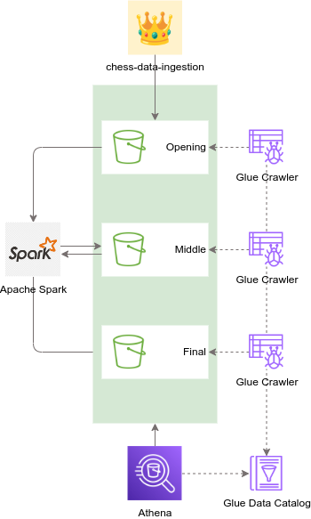
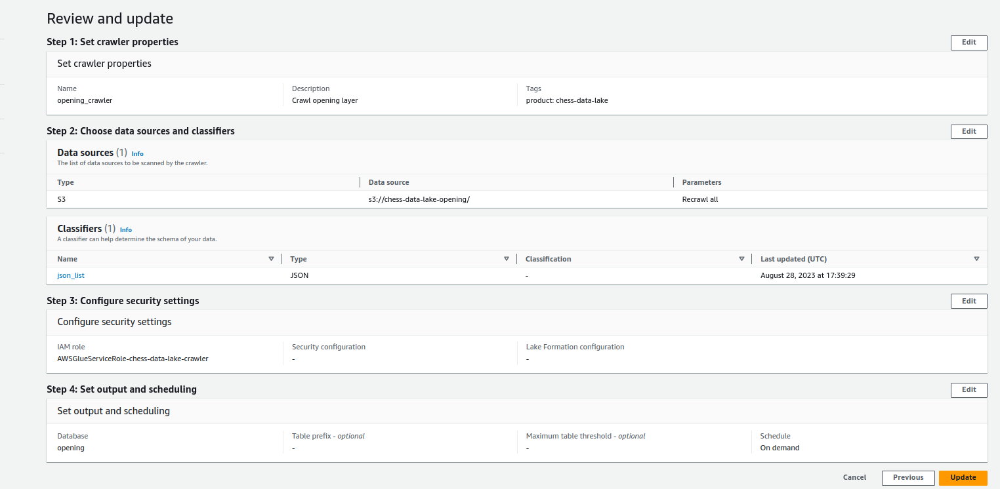
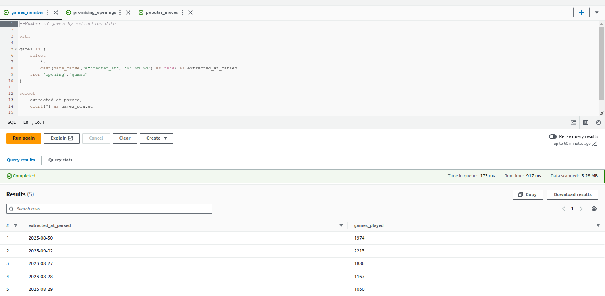
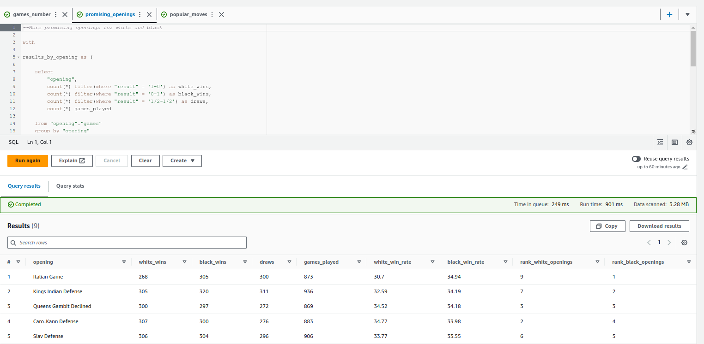
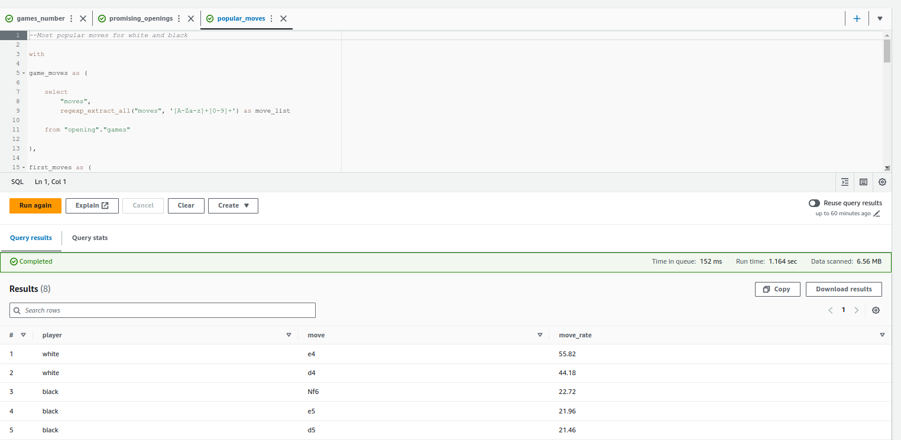

## chess-data-lake

Este é um projeto de Data Lake usando os serviços da [AWS](https://aws.amazon.com/) apresentado como solução para o desafio do [Bootcamp Engenharia de Dados AWS](https://howedu.com.br/cohort/engenharia-de-dados) da How Education.

O desafio foi dividido em duas etapas, sendo que na primeira etapa, deveria realizar os seguintes passos:

1. Gerar dados fictícios sobre algum assunto de interesse e realizar a ingestão dos dados em um Data Lake hospedado no [S3](https://aws.amazon.com/pt/s3/).
2. Configurar um crawler usando o [Glue](https://aws.amazon.com/pt/glue/) para catalogar os dados em tabelas.
3. Realizar 3 consultas nas tabelas criadas através do [Athena](https://aws.amazon.com/pt/athena/).

Para a segunda etapa, o projeto deveria satisfazer aos requisitos:

4. Processar os dados da primeira camada (opening ou raw) para a segunda (middle ou stage).
5. Processar os dados da segunda camada (middle ou stage) para a terceira (final ou curated).
6. Catalogar as tabelas da segunda e terceira camadas com o Glue.

## Proposta de Solução

A solução proposta consiste em um Data Lake para armazenar dados de jogos de xadrez.

Foram criados 3 buckets no S3 para compor o Data Lake. Os buckets foram organizados 
em camadas e elas foram nomeadas como as fases de um jogo de xadrez:
1. `opening`: Camada de entrada dos dados, na qual os dados permanecem no formato original.
2. `middle`: Camada de dados processados e armazenados em formato parquet.
3. `final`: Camada de dados curados, na qual os dados são armazenados em formato parquet e particionados por casos de uso.

A imagem abaixo exibe o diagrama da solução final.



### 1. Dados fictícios

Foi desenvolvido um pacote Python para gerar dados fictícios de partidas de xadrez e armazená-los em um bucket do S3. O pacote está disponível no repositório [https://github.com/Jefersonalves/chess-data-ingestion](https://github.com/Jefersonalves/chess-data-ingestion).

O pacote gera arquivos JSON como o exemplo a seguir:

```json
{
    "event": "Rated Blitz game",
    "site": "https://www.chess.com",
    "white": "hdias",
    "black": "slima",
    "result": "1-0",
    "utc_date": "2022.11.23",
    "utc_time": "06:54:54",
    "white_elo": 2629,
    "black_elo": 2532,
    "white_rating_diff": 89,
    "black_rating_diff": 38,
    "eco": "E60",
    "opening": "Kings Indian Defense",
    "time_control": "300+0",
    "termination": "Normal",
    "moves": "1. d4 Nf6 2. c4 g6 3. Nc3 Bg7"
}
```

O pacote foi usado para simular a geração de dados em um aplicativo de xadrez nomeado `app` e realizar a ingestão na camada `opening`.

### 2. Configuração do Crawler

O crawler do Glue foi configurado para catalogar a camada `opening` como uma database e os dados do `app` como uma tabela. A imagem abaixo exibe o crawler criado.



A instrução DDL para criação da tabela está disponível no arquivo [sql/opening_app_games_ddl.sql](sql/opening_app_games_ddl.sql).

### 3. Consultas no Athena

Uma vez que a tabela estava catalogada, foi possível realizar consultas através do Athena.
As consultas realizadas abordaram diferentes casos de uso.

A primeira consulta ([sql/games_number.sql](sql/games_number.sql)) retorna o número de partidas por data de extração.


A segunda ([sql/promising_openings.sql](sql/promising_openings.sql)) calcula a taxa de vitória das aberturas para os jogadores de brancas e negras.


A terceira ([sql/popular_moves.sql](sql/popular_moves.sql)) busca identificar quais são os primeiros movimentos mais comuns para ambos os jogadores.


### 4. Processamento da camada `opening` para `middle`

Os dados da camada `opening` estão disponíveis como arquivos no formato json particionados por data de extração.
O script [scripts/opening_to_middle.py](scripts/opening_to_middle.py) carrega os dados nesse formato inicial e usa o [Apache Spark](https://spark.apache.org/) para transformá-los e armazená-los na camada `middle` no formato colunar parquet.
Foram feitas transformações para converter os tipos de dados, adicionar e remover colunas, criar novas colunas derivadas e particionar a tabela pelo ano em que o jogo foi realizado.

### 5. Processamento da camada `middle` para `final`

Uma feature comum em apps de xadrez é exibir o ranking dos jogadores baseado em seus ratings atuais.
A fim de disponibilizar as informações para a construção dessa feature no app, foi criado o script [scripts/middle_to_final.py](scripts/middle_to_final.py). O script carrega os dados da camada `middle`, obtém o rating mais recente de todos os jogadores, faz o ranqueamento dos jogadores atribuindo lhes o percentil em que se encontram e, por fim, os dados são particionados pelo formato de tempo dos jogos e armazenados na camada `final`.

### 6. Catalogação das tabelas da camada `middle` e `final`

Foram criados crawlers para catalogar as tabelas da camada `middle` e `final`.
Os arquivos DDL para a criação das tabelas estão disponíveis em [sql/middle_app_games_ddl.sql](sql/middle_app_games_ddl.sql) e [sql/final_players_rank_ddl.sql](sql/final_players_rank_ddl.sql).